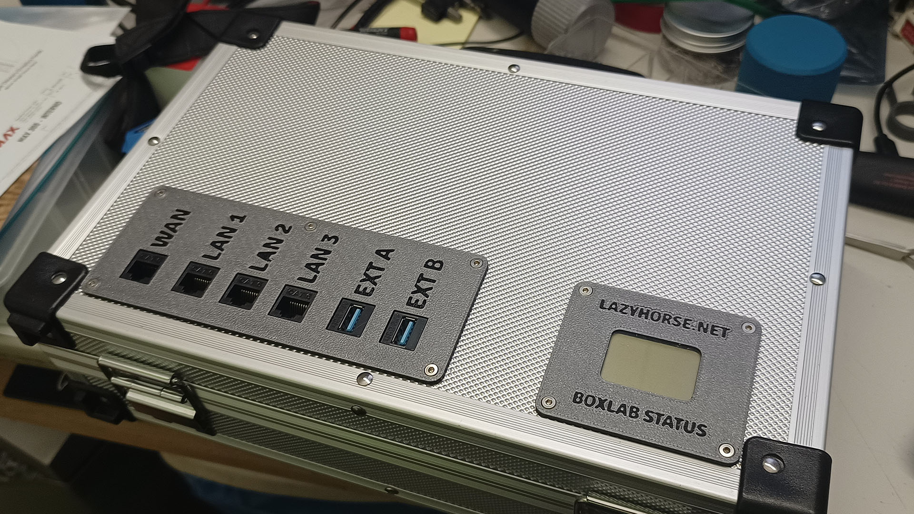
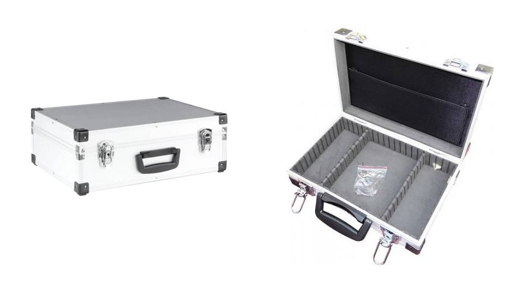
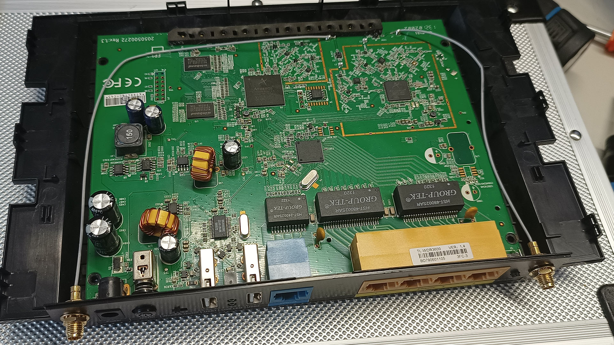
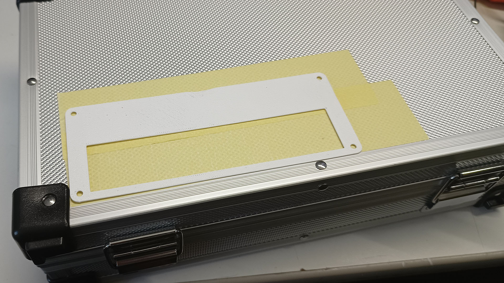
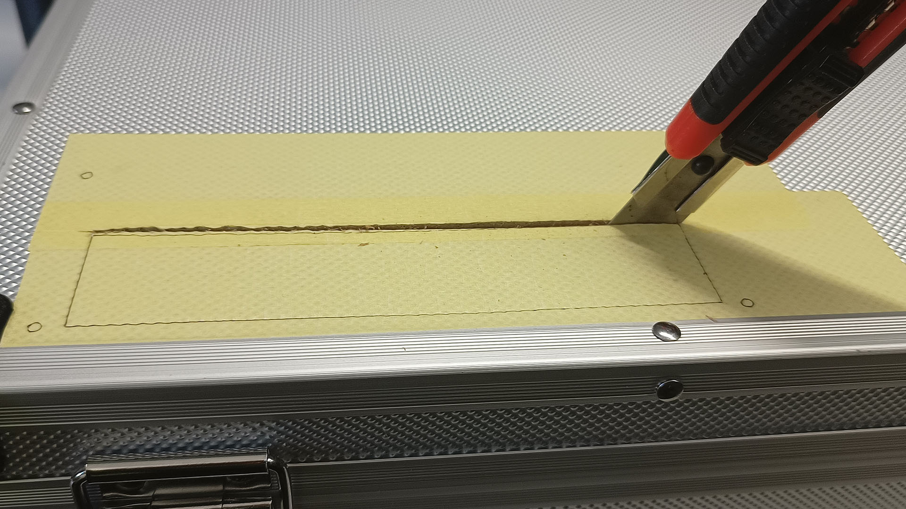
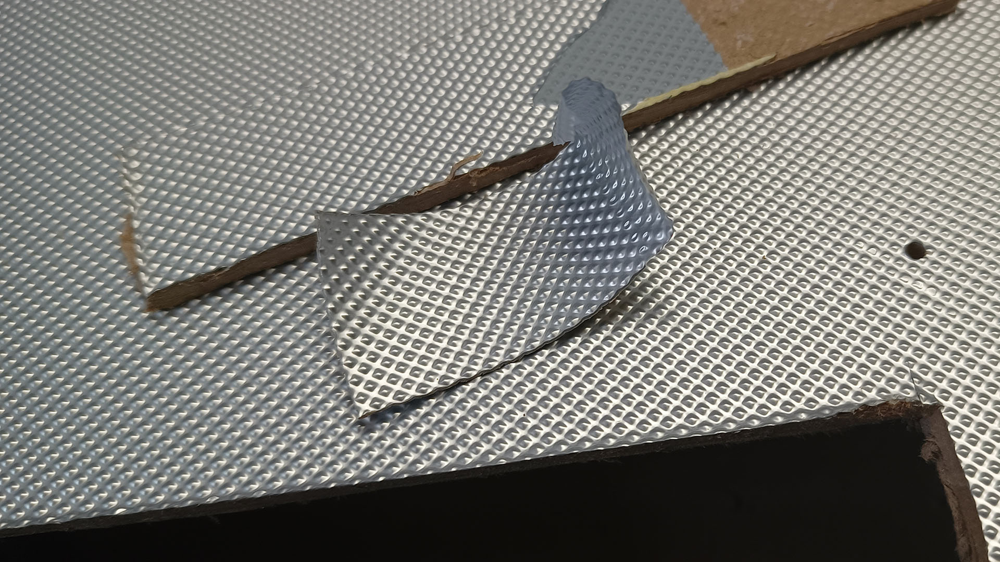
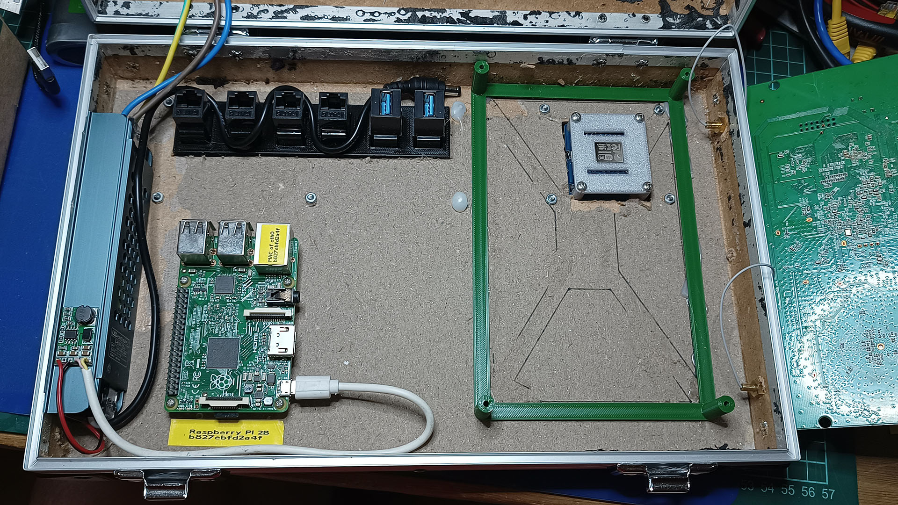
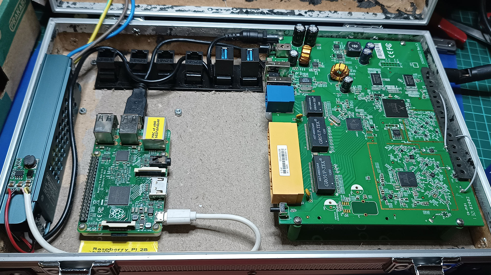
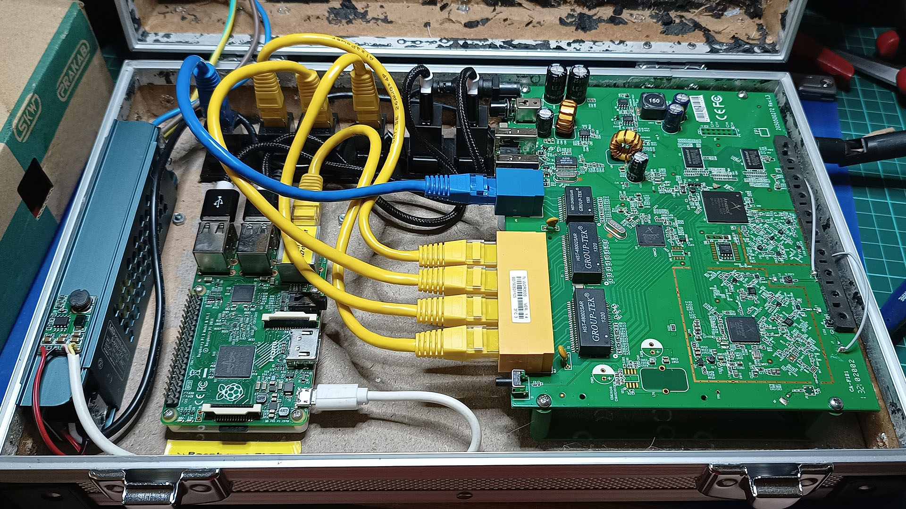

# BoxLab

This is a simple project of 'lab in a box'. I teach courses where I need controlled network environment, connected to the Internet. So I created a box, containing all the necessary hardware and software.

While I don't expect anyone to exactly replicate my build (because your requirements are likely different from mine), it still may be good inspiration.

## Hardware

### Casing

**[Magg ALK300](https://www.magg.cz/cs/kufr-330-x-210-x-90-mm-al-design-product-65ddb5a4387454001b876ca3)**, small toolbox case, widely available from local retailers (at least in Czech Republic). It features aluminium design, but in fact is made from cardboard with thin Al foil, so it's easy to cut.

### Devices

* **TP-Link TL-WDR3600**, broadband router with 1x WAN, 4x LAN, 2.4 GHz & 5 GHz Wi-Fi. This is an older model I had at home, remnants of the Samknows project. You can use any router, as long as it has the characteristics you need. I also recommend models with detachable antenna connectors (not mounted on PCB).
* **Raspberry Pi** or similar small computer as a server. I used version 2B, because that's what I had laying around and it's powerful enough for what I need.
* **[Nokia 5110 LCD with PCD8544 controller](https://s.click.aliexpress.com/e/_DCIYKsB)** and **[Wemos D1 Mini](https://s.click.aliexpress.com/e/_DeEkjgj)** ESP8266 board. They form the [status display](StatusDisplay.md). 

### Power

* **[12 V 60 W LED power supply](https://s.click.aliexpress.com/e/_DF4n74T)** to power everything inside.
* **[12 V to 5 V step-down converter](https://s.click.aliexpress.com/e/_Dd9Amjl)** to power the Raspberry Pi from 12 V.

### Cables and connectors

* **[RJ45 keystone jacks](https://s.click.aliexpress.com/e/_DELTtWP)** x4 for outside connection: 1x WAN, 3x LAN, remaining LAN port is used internally to conntect to Raspberry Pi.
* **[USB keystone jacks](https://s.click.aliexpress.com/e/_DmQUknl)** x2, for outside access to Raspberry Pi and/or router.
* Short **RJ45 patch cables** (x5) and **[USB A-A cables](https://s.click.aliexpress.com/e/_DFyvKIx)** (x2) to connect internal devices to keystones.
* Short **USB to MicroUSB cable** (x2) to power the Raspberry Pi and status display.
* Short **DC barrel jack cable** to power the router.
* **[IEC 14 panel inlet](https://s.click.aliexpress.com/e/_DCKmVif)** for mains power connection.

### 3D printed parts

* Cutting templates
    * [IEC 14 connector](3D/C14/c14-template.stl)
    * [Keystone panel](3D/KeystonePanel/KeystonePanel-template.stl)
    * Status display [R3](3D/StatusDisplay/StatusDisplay-R03-template.stl) or [R4](3D/StatusDisplay/StatusDisplay-R04-template.stl)
* Status display panel and riser [R3](3D/StatusDisplay/StatusDisplay-R03.stl) or [R4](3D/StatusDisplay/StatusDisplay-R04.stl)
* [Keystone panel](3D/KeystonePanel/KeystonePanel.stl)

### Putting it together

Cut the holes in the Al case. Use the 3D printed template to cut and drill the holes. You may use sharp box knife to cut rectangular holes. I removed the internal padding for easier mounting and better cooling, although it leaves very ugly finish. If I would do it again, I would remove it only from the lid, not from the bottom.

The construction is obvious from photos. Everything (except the IEC 14 socket) is mounted in the lid of the box. The 12 V power supply is held by double sided tape, the PCB brackets using hot glue.

## Software

The software setup would depend on what you need from your lab. For me, the following works:

* The TP-Link TL-WDR3600 router has DD-WRT firmware flashed in. It has several roles:
    * Router to connect the internal network to Internet.
    * DHCP, internal DNS
    * WiFi AP for both 2.4 GHz and 5 GHz.
    * PPTP VPN server to allow access to the internal network from outside. I know that PPTP is not secure, but for this scenario I don't care.
* The Raspberry Pi 2B is running standard Raspberry Pi Lite OS. It again has several roles:
    * HTTP and HTTPS web server (nginx) for materials distribution.
    * MQTT server (Mosquitto) for IoT scenarios, running on ports 1883 (MQTT), 8883 (MQTT over TLS) and 8884 (MQTT over WebSockets over TLS).