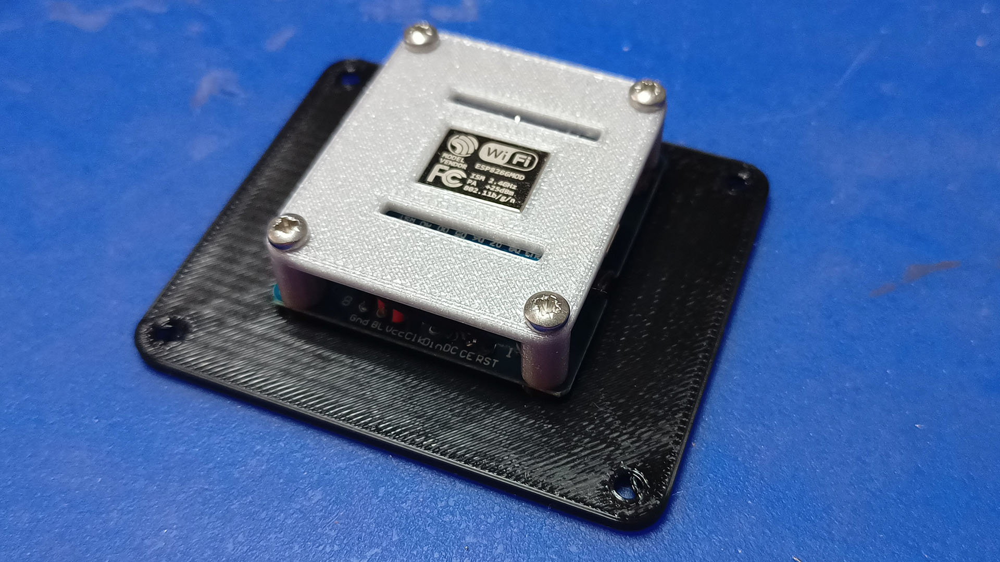
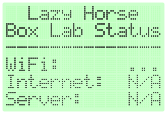
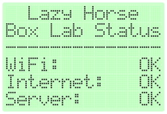
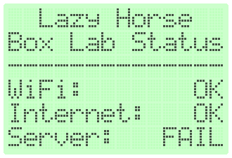
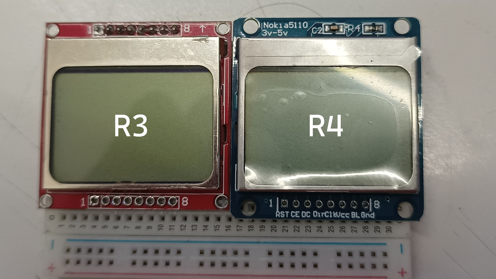

# Status display for the Lazy Horse BoxLab

This module uses LCD from the famous Nokia 5110 phone (and still available today) with the PCD8544 controller, connected to Wemos D1 Mini (ESP8266) to show status of the BoxLab system. We are monitoring:

* If the router Wi-Fi network `boxlab.lazyhorse.net` is accessible.
* If we can connect to the Internet (HTTPS request to `www.google.com` returns `200 OK`).
* If the internal lab server is running (HTTPS request to `www.boxlab.lazyhorse.net` returns `200 OK`).

The ESP8266 microcontroller is pretty outdated today, but is widely available, very cheap and frankly speaking, good enough for our purpose. Its mainly drawback is very poor TLS implementation, which makes almost impossible to do proper server certificate validation in HTTPS. For our purpose, we can simply ignore the validation and accept any certificate the server provides.

Status                       | Meaning
---------------------------- | ---------------------------------------------------------------------------------
 | **Not connected to Wi-Fi** (ie. after startup)
 | **Everything OK** (both Internet and internal server are accessible)
 | **Something wrong** (here Internet is accessible, but the internal server is not)

## Hardware

You need:

* **[Wemos D1 Mini](https://s.click.aliexpress.com/e/_DeEkjgj)** or any ESP8266-based board; the D1 Mini is cheap, widely available and has a fixed form factor, unlike some other boards.
* **[Nokia 5110 LCD with PCD8544 controller](https://s.click.aliexpress.com/e/_DCIYKsB)**, which is, again, widely available as a breakout module.

The displays come in two form factors I am aware of and require different 3D printed parts. The smaller version (red on the photo above) is 43 x 42 mm and has two sets of pins on top and bottom. It requires the _R3_ version of printed parts. The larger version (blue) is 43 x 46 mm and has only one set of pins on the bottom. Requires the _R4_ printed parts.

They both feature the same display and ale electrically compatible, but their different PCB sizes and mounting hole placements require accommodation.

If you'll consider yet another variant, you'll have to modify the OpenSCAD source files. I recommend you to start with `StatusDisplay-R04.scad`, as its construction is more parametric and easier to modify (everything is offsetted from center, older R3 offsets from various points that seemed logical at the time).

### Connections

Then connect the modules as follows:

LCD        | ESP8266
---------- | ------------
RST        | D2 (GPIO 4)
CE (CS)    | D8 (GPIO 15)
DC         | D1 (GPIO 5)
DIN (MOSI) | D7 (GPIO 13)
CLK (SCK)  | D5 (GPIO 14)
VCC        | 3V3
GND        | GND

The contraption is powered from USB port of the internal server (Raspberry Pi). This allows opportunity for further expansion -- you can write some more complex firmware, which can ie. display the Pi status, load etc.

## Software

The firmware is written using [PlatformIO](https://platformio.org/). It requires the following libraries from Adafruit:

* [Adafruit PCD8544 Nokia 5110 LCD library](https://github.com/adafruit/Adafruit-PCD8544-Nokia-5110-LCD-library)
* [Adafruit GFX library](https://github.com/adafruit/Adafruit-GFX-Library)

## Configuration

Use `#define` directives in the source file to setup the following configuration parameters:

Name             | Deault value             | Comment
---------------- | ------------------------ | -------
`WIFI_SSID`      | `"boxlab.lazyhorse.net"` | WiFi network name
`WIFI_PASS`      | `"IHaveHorsePower!"`     | WiFi password
`LCD_CONTRAST`   | `35`                     | Contrast of the LCD - set experimentally for your conditions
`CHECK_INTERVAL` | `60000`                  | Interval between connectivity checks (ms)
`CHECK_TTL`      | `90000`                  | Reported TTL (ms)

## Serial communication

This module is powered from Raspberry Pi's USB port and will send status information, that can be used by the Pi. Communication speed is 9600 baud and it reports the following information:

* Any line beginning with `#` is comment.
* All other lines have format of `Name: value` separated by comma. The following values are present:

Name     | Value
-------- | --------------------------------------------------------------------
Version  | `1.0.0`
Time     | time in ms from device boot
TTL      | information TTL in ms
WiFi     | `OK` or `FAIL`
Internet | `N/A` or `OK` or `FAIL`
Server   | `N/A` or `OK` or `FAIL`

### TTL meaning

This specifies in how many ms (by default 90000, 90 seconds) should the next status line be sent. If it isn't, the device itself failed. Please note: next line can be sent earlier than that (by default every 60 seconds).

### WiFi status meaning

* `OK` - connected to wireless network
* `FAIL` - disconnected, trying to connect

### Internet status meaning

* `OK` - the `http://www.msftncsi.com/ncsi.txt` URL returns `200 OK`
* `FAIL` - any other kind of response
* `N/A` - untested, not connected to Wi-Fi

### Server status meaning

* `OK` - the `https://www.boxlab.lazyhorse.net/` URL returns `200 OK`
* `FAIL` - any other kind of response
* `N/A` - untested, not connected to Wi-Fi